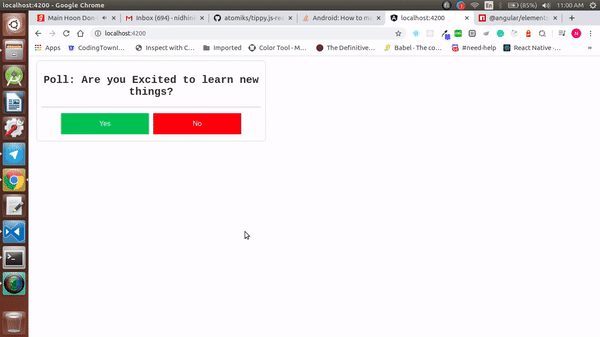

# ElementsApp aka Angular Elements

This project is about how to create angular elements in Angular9

## Development server

Run `ng serve` for a dev server. Navigate to `http://localhost:4200/`. The app will automatically reload if you change any of the source files.

## Code scaffolding

Run `ng generate component component-name` to generate a new component. You can also use `ng generate directive|pipe|service|class|guard|interface|enum|module`.

## Build

Run `ng build` to build the project. The build artifacts will be stored in the `dist/` directory. Use the `--prod` flag for a production build.

## Plugins

Plugins needed for angular elements are

*  @angular/elements - `npm i @angular/elements`
*  @webcomponents/customelements - `npm i @webcomponents/custom-elements`

Once the plugins are installed go to polyfills.ts file and import the webcomponents like below

```
import '@webcomponents/custom-elements/src/native-shim';
import '@webcomponents/custom-elements/custom-elements.min';
```

## Creating an Angular Element

Create a new component and create your own styles / pages you wish and then go to `app.module.ts` file and do the below steps

1. Remove the components in bootstrap and make bootstrap as empty
2. Since we are going to use the component as angular element add it in entrycomponents like below
```
  bootstrap: [],
  entryComponents: [UserpollComponent]
```
3. Inside the AppModule class add the below things

```
export class AppModule {
  constructor(public injector: Injector) {}

  ngDoBootstrap() {
    const e1 = createCustomElement(UserpollComponent, { injector: this.injector });

    customElements.define('user-poll', e1);
  }
```

In the above code we are creating a customElement with the component which we have created earlier and then defining a tag for the element we created

4. In the  `index.html` file remove all the predefined ones and add the component which you have created like below 

```
<user-poll></user-poll>

```

5. Inside the userpoll.component @Component decorator add the encapsulation tag like below

```
@Component({
  selector: 'app-userpoll',
  templateUrl: './userpoll.component.html',
  styleUrls: ['./userpoll.component.css'],
  encapsulation: ViewEncapsulation.ShadowDom,
})
```

6. When we build the project in production mode we will the static files in different versions like below

```
'main-es2015.js',
'main-es5.js',
'polyfills-es2015.js',
'polyfills-es5.js',
'runtime-es2015.js',
'runtime-es5.js'
```

but we need a single js file to achieve it we need to install a plugin named

* concat - `npm i concat`
* fs-extra - `npm i fs-extra`

once the plugins are installed create a new file build-script.js in the root folder and add the below code

```
const fs = require('fs-extra');
const concat = require('concat');

(async function build() {
  const files = [
    './dist/elementsApp/main-es2015.js',
    './dist/elementsApp/main-es5.js',
    './dist/elementsApp/polyfills-es2015.js',
    './dist/elementsApp/polyfills-es5.js',
    './dist/elementsApp/runtime-es2015.js',
    './dist/elementsApp/runtime-es5.js'
  ]

  await fs.ensureDir('elements')

  await concat(files, 'elements/user-poll.js')
  console.log('Elements got created');
})()

```

Inside the package.json file add the below scripts to build the elements

```
"build:elements": "ng build --prod --output-hashing none && node build-script.js"
```

and when we run the project with the command `npm run build:elements` it will create the build file with a single js file

7. Now we can upload the js file to any storage and we can use the reference in script tag
8. Now create an html project and inside the index.html page import the script tag and import the tag like below `<user-poll> </user-poll>`

Now we can run the angular project in any language like

* Reactjs
* Vue.js
* Vanilla script
* Normal HTML Page

## Output


